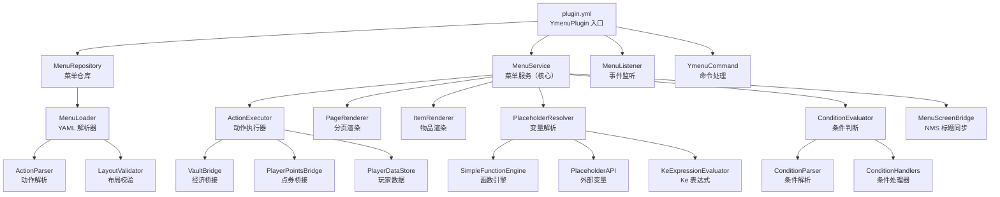

# Ymenu 项目深度分析报告

## 一、项目定位

**Ymenu** 是一个 **Bukkit/Spigot/Folia 多平台 GUI 菜单插件**，目标是实现 **TrMenu 的核心菜单功能子集**——读取 TrMenu 风格的 YAML 菜单配置文件，解析并渲染为服务器箱子 GUI 界面。

- **包名**: `cc.neurons.ymenu`
- **API 版本**: Spigot 1.20.4
- **JVM**: Java 17 + Kotlin 2.0
- **构建**: Gradle + Shadow（将 Kotlin stdlib 重定位到 `cc.neurons.ymenu.libs.kotlin`）
- **Folia 支持**: ✅ 已声明 `folia-supported: true`

---

## 二、架构总览



---

## 三、模块详解

### 3.1 插件入口 — `YmenuPlugin.kt`

| 职责 | 说明 |
|------|------|
| 初始化 | `saveDefaultConfig()` → 释放默认资源 → 检测平台（Spigot/Folia）|
| 核心服务 | 创建 `PlaceholderResolver`、`MenuRepository`、`MenuService` |
| 事件注册 | 注册 `MenuListener` |
| 命令注册 | `/ymenu open <id> [player]`、`/ymenu reload` |
| 关闭清理 | 取消所有定时任务 + flush 玩家数据 |

### 3.2 配置加载 — `config` 包

#### `MenuRepository`
- 从 `menus/` 目录递归扫描所有 `.yml` 文件
- 用 `MenuLoader` 解析每个文件为 `MenuDefinition`
- 自动去重（同 id 优先深层目录文件）
- 建立 **命令绑定索引**（`Bindings.command` → 菜单 id）
- 启动时做 **引用校验**（按钮/open-actions 里引用的菜单 id 是否存在）

#### `MenuLoader`
- 兼容 TrMenu 配置字段名的模糊匹配（大小写不敏感 + 多别名）：
  - `Shape` / `Layout` / `layout` → 布局
  - `BUTTONS` / `Icons` → 按钮定义
  - `Events.Open` / `Open-Actions` → 打开动作
- 支持**多页布局**（`Layout` 为二维列表时自动拆页）
- 按钮支持 **variant 条件皮肤**（`icon/icons` 列表）

### 3.3 数据模型 — `model` 包

| 类 | 说明 |
|----|------|
| `MenuDefinition` | 菜单定义（标题、布局、按钮、事件、分页、函数）|
| `ButtonDefinition` | 按钮定义（外观、动作、条件、冷却、类型）|
| `ButtonVariantDefinition` | 按钮条件变体（条件为真时覆盖外观/动作）|
| `DisplaySpec` | 物品展示规格（material/mat/mats + name + lore + shiny）|
| `ActionSpec`（密封接口）| **26 种动作类型**，见下表 |
| `ConditionSpec` | 条件规格（源、表达式、运算符、期望值）|
| `ClickType` | 点击类型映射（LEFT/RIGHT/SHIFT_LEFT 等 → Bukkit ClickType）|
| `PageSpec` | 分页配置（slots + elements）|

### 3.4 动作系统 — `action` 包

#### 支持的 26 种动作

| 动作类型 | 配置语法示例 | 说明 |
|---------|-------------|------|
| `MenuActionSpec` | `open: menu_id` | 打开菜单 |
| `BackActionSpec` | `back` / `back: fallback_id` | 返回上级 |
| `CloseActionSpec` | `close` | 关闭菜单 |
| `SoundActionSpec` | `sound: BLOCK_NOTE-1-2` | 播放声音 |
| `ConsoleActionSpec` | `console: give %player% diamond 1` | 控制台命令 |
| `TransactionalConsoleActionSpec` | `console: pokegive ...` | **事务性控制台命令**（支持回滚）|
| `PlayerCommandActionSpec` | `command: home 1` / `player: ...` | 玩家执行命令 |
| `TellActionSpec` | `tell: &a消息` | 发送消息 |
| `ActionBarActionSpec` | `actionbar: 消息` | ActionBar 消息 |
| `TitleActionSpec` | `title: 主标题\|副标题\|10\|40\|10` | Title 消息 |
| `BroadcastActionSpec` | `broadcast: 全服消息` | 全服广播 |
| `SetTitleActionSpec` | `set-title: 新标题` | 动态改菜单标题 |
| `DelayActionSpec` | `delay: 20` | 延迟（tick）|
| `RefreshActionSpec` | `refresh` / `update: reopen` | 刷新界面 |
| `NextPageActionSpec` | `next page` | 下一页 |
| `PrevPageActionSpec` | `prev page` | 上一页 |
| `SetPageActionSpec` | `set page: 2` | 跳转到指定页 |
| `VaultActionSpec` | `vault give: 100` / `take-money: 50` | Vault 经济 |
| `PointsActionSpec` | `give-point: 100` | PlayerPoints 点券 |
| `ItemActionSpec` | `give item: DIAMOND 5` | 物品给予/扣除 |
| `VariableActionSpec` | `set var: key value` / `inc var: count` | 会话变量操作 |
| `MetaActionSpec` | `set-meta: key value` | 会话元数据 |
| `DataActionSpec` | `set-data: key value` | 持久化玩家数据 |
| `CatcherActionSpec` | `catcher: { input: { type: CHAT } }` | 聊天/告示牌输入捕获器 |
| `ConditionalActionSpec` | `{ condition: ..., actions: [...] }` | 条件分支（支持 ALL/ANY）|
| `StopActionSpec` | `return` | 停止后续动作 |
| `ResetActionSpec` | `reset` | 重置函数缓存 |

#### 事务机制（独创亮点）
- 检测到 `TransactionalConsoleActionSpec`（如 `pokegive`、`pokeedit`、`pokedel` 等 Pixelmon 命令）时自动启用事务
- **预提交阶段**：Vault/Points 扣款操作自动记录回滚函数
- **失败回滚**：后续命令失败时自动反向回滚已扣款项
- **提交策略**：多个事务命令时仅最后一个 commit，其余 defer

### 3.5 条件系统 — `condition` 包

| 条件源 | 语法 | 说明 |
|--------|------|------|
| `PAPI` | `check papi %player_level% >= 10` | PlaceholderAPI 变量比较 |
| `VAR` | `check var %ymenu_var_x% == 1` | 会话变量比较 |
| `STRING` | `check string abc == abc` | 字符串比较 |
| `NUMBER` | `check number 5 > 3` | 数值比较 |
| `PERMISSION` | `perm admin.use` / `!perm vip` | 权限检查 |
| `OP` | `is op` | OP 检查 |
| `ITEM` | `has item DIAMOND 5` | 背包物品检查 |
| `SPACE` | `has space 3` | 空闲格子检查 |
| `SLOT` | `slot contains 0 DIAMOND` | 指定格子物品检查 |
| `COOLDOWN` | `cooldown key 60` | 冷却时间检查 |
| `LIMIT` | `limit key 3 6000` | 频率限制检查 |

支持的比较运算符：`==`, `!=`, `>`, `>=`, `<`, `<=`, `contains`, `starts_with`, `ends_with`, `matches`

### 3.6 渲染系统 — `render` 包

| 组件 | 职责 |
|------|------|
| `PlaceholderResolver` | 解析内部占位符 + PAPI + 函数扩展 + KeExpression |
| `ItemRenderer` | 将 `DisplaySpec` 渲染为 `ItemStack` |
| `ItemResolver` | 字符串 → `Material` 映射（支持 `mats` 缩写格式）|
| `SoundParser` | 声音字符串解析（`SOUND-volume-pitch`）|

#### 支持的占位符

| 占位符 | 说明 |
|--------|------|
| `%ymenu_page%` | 当前页码 |
| `%ymenu_max_page%` | 最大页码 |
| `%ymenu_has_next_page%` | 是否有下一页 |
| `%ymenu_has_prev_page%` | 是否有上一页 |
| `%ymenu_var_xxx%` | 会话变量 |
| `%trmenu_data_xxx%` / `{trmenu_data_xxx}` | 玩家持久数据（兼容 TrMenu）|
| `%trmenu_meta_xxx%` / `{meta:xxx}` | 会话元数据（兼容 TrMenu）|
| `{input}` | 捕获器输入值 |
| `@key@` | 上下文变量 |
| `${函数名}` | 菜单 Functions 区域定义的自定义函数 |

### 3.7 函数引擎 — `function` 包

#### `SimpleFunctionEngine`
内置一个简易的**类 JavaScript 脚本引擎**，支持：
- 变量声明（`var x = 1`）
- 算术运算（`+`, `-`, `*`, `/`）
- 条件分支（`if / else if / else`）
- `for` 循环（含最大迭代限制 10,000）
- `return` 返回值
- 内置函数：`vars()`（解析文本占位符）、`varInt()`（解析为数值）
- 数组操作：`new Array(...)`, `[index]`, `.length`
- 格式化：`.toFixed(digits)`

> [!IMPORTANT]
> 这是 TrMenu 中 JavaScript/Kether 脚本功能的**极简替代品**，不需要依赖 Nashorn/GraalJS。

### 3.8 平台适配 — `platform` 包

| 类 | 说明 |
|----|------|
| `PlatformDetector` | 反射检测是否为 Folia 环境 |
| `PlatformScheduler` | 调度器抽象接口 |
| `SpigotScheduler` | Bukkit 标准调度实现 |
| `FoliaScheduler` | Folia 区域化调度实现 |

### 3.9 其他组件

| 组件 | 说明 |
|------|------|
| `MenuScreenBridge` | 反射调用 `InventoryView.setTitle()` 实现不重开容器刷新标题 |
| `PlayerDataStore` | 基于 `config.yml` 的简易键值持久化 |
| `ResourceInstaller` | 首次启动时按 `menus.index` 释放默认菜单文件到 `menus/` |
| `MenuHolder` | 自定义 `InventoryHolder` 标记菜单库存 |
| `MenuSession` | 玩家菜单会话（当前页/变量/元数据/历史/冷却/定时任务）|

---

## 四、TrMenu 兼容性对照

下表展示 Ymenu 对 TrMenu 功能的覆盖情况：

| TrMenu 功能 | Ymenu 状态 | 说明 |
|-------------|-----------|------|
| YAML 菜单配置 | ✅ 完整 | 兼容 `Title`/`Shape`/`Layout`/`BUTTONS`/`Icons` |
| 多页布局 | ✅ 完整 | Layout 数组自动拆页 |
| 按钮条件变体（Icon优先级） | ✅ 完整 | `icon`/`icons` 列表 + condition |
| 点击事件分类 | ✅ 完整 | LEFT/RIGHT/SHIFT/ALL 等 |
| 动作链（按顺序执行） | ✅ 完整 | 含 delay 和条件分支 |
| 输入捕获器 | ✅ 基础 | 仅 CHAT 类型，SIGN 仍会退化为 CHAT |
| 关闭拦截 | ✅ 完整 | `Close-Deny-Conditions` + 重新打开 |
| 命令绑定 | ✅ 完整 | `Bindings.command` |
| 标题动态刷新 | ✅ 完整 | `Title-Update` + `set-title` + NMS 反射 |
| PlaceholderAPI | ✅ 完整 | 反射调用，不硬依赖 |
| Vault 经济 | ✅ 完整 | give/take + 事务回滚 |
| PlayerPoints | ✅ 完整 | give/take + 事务回滚 |
| JavaScript 脚本引擎 | ⚠️ 简化替代 | `SimpleFunctionEngine` 替代，不需要 GraalJS |
| Kether 脚本 | ❌ 未实现 | 用 `SimpleFunctionEngine` + 条件系统替代 |
| 数据库存储（MySQL/SQLite） | ❌ 未实现 | 仅文件级 `PlayerDataStore` |
| 物品仓库 | ❌ 未实现 | |
| 全局数据同步 | ❌ 未实现 | |
| 自定义材质/头颅 | ⚠️ 基础 | 仅 `Material` 名称解析 |
| 动画帧 | ❌ 未实现 | |

---

## 五、项目内置菜单模板

资源目录 (`src/main/resources/menus/`) 按功能分类：

```
menus/
├── core/
│   └── menu.yml              # 主菜单
├── economy/
│   ├── finance.yml           # 经济总览
│   ├── pay_menu.yml          # 转账
│   ├── permission_shop.yml   # 权限商店
│   └── point_shop.yml        # 点券商店
├── enchant/
│   ├── enchant_book_shop.yml       # 附魔书商店（主页）
│   ├── enchant_book_shop_armor.yml # 护甲附魔
│   ├── enchant_book_shop_curse.yml # 诅咒附魔
│   ├── enchant_book_shop_tool.yml  # 工具附魔
│   ├── enchant_book_shop_trident.yml # 三叉戟附魔
│   └── enchant_book_shop_weapon.yml  # 武器附魔
├── player/
│   ├── achievement_menu.yml  # 成就菜单
│   ├── home_menu.yml         # 家设置菜单
│   ├── portable_tools_menu.yml # 便携工具
│   └── skin.yml              # 皮肤
└── teleport/
    ├── chuansong.yml          # 传送菜单
    └── world_tp_page_2.yml    # 世界传送第二页
```

---

## 六、代码质量评估

### 优点 ✅
1. **架构清晰**：模块化分离（config / model / action / condition / render / menu / platform / function），职责单一
2. **TrMenu 兼容性好**：字段名模糊匹配 + 多别名支持，可直接读取大多数 TrMenu 菜单文件
3. **Folia 支持**：原生适配区域化调度器
4. **事务机制**：针对 Pixelmon 等不可逆命令的扣款保护
5. **零外部框架依赖**：不依赖 TabooLib/Kether/GraalJS，纯 Bukkit API + 反射
6. **TypeSafe Action 模型**：密封类体系让动作类型在编译期有保障

### 可改进的地方 ⚠️
1. **PlayerDataStore** 使用文件存储，高并发下可能丢数据
2. **没有 hot-reload 机制**（文件监听），需手动 `/ymenu reload`
3. **Sign 捕获器**标记为 `SIGN` 类型但实际退化为 CHAT
4. **SimpleFunctionEngine** 功能有限，复杂逻辑可能不够用
5. **缺少单元测试覆盖**（test 目录似乎缺失实际测试文件）

---

## 七、总结

Ymenu 是一个**轻量级的 TrMenu 替代品**，设计目标是：

> **不依赖 TabooLib 框架，用纯 Bukkit API 实现 TrMenu 的日常菜单功能**

它覆盖了 TrMenu 约 **70-80%** 的常用功能，特别是：
- YAML 配置解析与兼容
- GUI 渲染与交互
- 动作链执行（含延迟、条件、事务）
- 经济/点券/物品操作
- PlaceholderAPI 集成
- 多平台调度器

**不包含**的 TrMenu 高级功能：
- Kether 脚本引擎
- MySQL/SQLite 数据库
- 动画帧系统
- 自定义头颅/物品仓库
- 全局数据跨服同步
